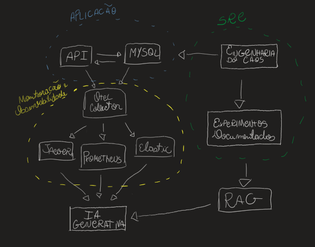

# Projeto AIOps com SRE

## Descrição
Este projeto tem como objetivo aplicar os conceitos de SRE (Site Reliability Engineering) e AIOps (Artificial Intelligence for IT Operations) em uma aplicação simples, utilizando OpenTelemetry para monitoramento contínuo.

Para aumentar a robustez e a capacidade de diagnóstico do sistema, será adotada a estratégia de Engenharia do Caos, simulando falhas planejadas e variações de tráfego de usuários. Esses testes serão documentados e utilizados para construir uma base de conhecimento que alimentará uma RAG (Retrieval-Augmented Generation) para um modelo de IA generativa.

O foco principal é criar e documentar exemplos reais de cenários de indisponibilidade. Em testes futuros, o modelo será capaz de recuperar casos similares da base de conhecimento e oferecer diagnósticos detalhados para identificar possíveis causas de falhas na aplicação.

Com essa abordagem, o projeto busca unir práticas modernas de monitoramento, aprendizado de máquina e engenharia do caos para construir um fluxo de dados resiliente e inteligente, capaz de auxiliar na prevenção e na rápida resolução de incidentes em ambientes de produção.

## Arquitetura

## Estrutura do Projeto

1. **Monitoramento e Observabilidade de Aplicações**
    - Implementar monitoramento com OpenTelemetry.
    - Coletar logs, métricas, traces e eventos da aplicação.

2. **Fluxo de Dados**
    - Criar um pipeline de dados que alimente uma base histórica.
    - Configurar serviços online para consumir os dados armazenados.

3. **Testes de Resiliência**
    - Implementar Chaos Engineering para aplicar testes planejados.
    - Gerar exemplos de falhas e gargalos para alimentar a base histórica.
    - Gerar tráfego sintético de usuários e operações reais.
    - Litmus, chaos Mesh, Gremlin, etc.

4. **Orquestração de Contêineres**
    - Configurar o projeto para rodar em um cluster Kubernetes.
    - Criar arquivos de configuração YAML para deploy da aplicação e dos serviços de monitoramento.

5. **AIOps**
    - Ser capaz de avaliar o estado do sistema
    - Processar logs e traces para identificar a causa de falhas
    - Sugerir procedimentos de correção
    - Retroalimentar o sistema com dados históricos e rótulos

6. **Métricas de Avaliação**
    - 4 Golden Signals
    - Status de Disponibilidade
    - SLI, SLO, SLA
    - MTTR, MTTD
    - Falsos Positivos, Falsos Negativos

## AIOps

1. Diagnosticar o estado do sistema
    - Avaliar métricas de desempenho
    - Identificar falhas e gargalos
    - Avaliar orçamento de erros
    - Buscar ocorrências de eventos
    - Recuperar histórico

2. Processar logs e traces
    - Identificar eventos de falha
    - Identificar eventos de recuperação
    - Identificar eventos de manutenção

3. Sugerir procedimentos de correção
    - Identificar causa raiz
    - Sugerir procedimentos de correção

## Chaos Engineering

1. Mapear o sistema
    - Identificar componentes críticos
    - Identificar pontos de falha
    - Identificar pontos de recuperação

2. Planejar testes
    - Definir cenários de falha
    - Definir cenários de recuperação
    - Definir métricas de avaliação

3. Executar testes
    - Simular falhas
    - Registrar experimento

4. Avaliar resultados
    - Comparar métricas
    - Avaliar impacto
    - Avaliar recuperação

## Passos para Desenvolvimento do Projeto

1. Criar a aplicação de teste
2. Implementar monitoramento com OpenTelemetry
3. Configurar pipeline de dados
4. Aplicar aiops basico
5. Implementar Chaos Engineering
6. Refinar busca de causa raiz
7. Implementar métricas de avaliação

## Cenários de teste
Objeto principal da pesquisa, essa etapa consiste em planejar alguns cenários de teste para avaliar o comportamento do sistema e subsidiar exemplos para geração de contexto histórico. 

Exemplo de cenários:

1. Alteração em uma das métricas de ouro
- A aplicação sofre um excesso de carga que impacta um Recurso X. 
- As métricas são armazenadas e o diagnóstico é documentado para futuras consultas.

- A aplicação sofre uma nova alteração que impacta um Recurso Y.
- O documento de diagnóstico anterior é recuperado e adicionado ao contexto.
- É esperado que o sistema identifique que o recurso Y foi impactado. 

2. Nova versão da aplicação
- A aplicação sofre uma atualização que impacta um endpoit X.
- As métricas são armazenadas e o diagnóstico é documentado para futuras consultas.

- A aplicação sofre uma nova alteração que impacta um endpoint Y.
- O documento de diagnóstico anterior é recuperado e adicionado ao contexto.
- É esperado que o sistema identifique que o endpoint foi impactado.

1. Falha de conexão com banco de dados
2. Ataque de negação de serviço
3. Falha de comunicação entre serviços
4. Implantação de nova versão que retorna erros

## Cenários de avaliação
1. 

## Desafios
  - Como passar para o modelo de LLM casos parecidos com os encontrados
  -

## Licença
Este projeto é licenciado sob a [MIT License](LICENSE).
